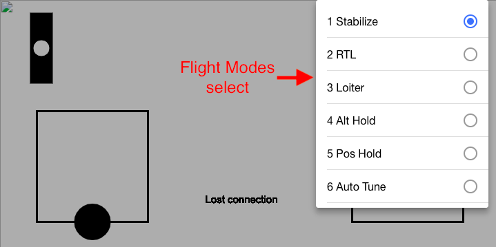

# DRONE Android Remote Control and Camera System

This repository is the soul of my Drone project. I believe with this repo being public, a lot of makers can be benefited by it.

<iframe width="420" height="345" src="https://youtu.be/WT0v0gHLbD4">
</iframe>
<iframe width="420" height="345" src="https://youtu.be/DX2KouBjVM8">
</iframe>

### Table of Contents  
- [The system of the Drone](#the-system-of-the-drone)  
- [Why?](#why)
- [Hardware Preparation](#hardware-preparation)
- [Receiver Side](#receiver-side)
- [Transmitter Side](#transmitter-side)
- [Future improvement](#emphasis)  

---
## The system of the Drone
The mechanism of the drone is categorized to the control of the drone's machinery and the communication system between the drone and the human. Additionally, there is a camera that is integrated in the drone to have the sky view of its surrounding.

I use APM 2.8.0 ArduPilot for the controller of the drone's machinery (brushless motors). That being said, the main contribution of this repository lies in the communication system of the remote control and the camera system. The communication system uses nRF24l01+ with Arduino as the middle-man. The data transmitted and received by the nRF24l01+ (2.4 GHz transceiver) is passed to the Arduino, before it is serially transferred to the phone via a cable. The camera system uses Raspberry Pi's camera for the vision and WiFi to communicate with the handphone. The use of Arduino and Raspberry Pi allows extension opportunity to advance the drone's functionality.

Conclusively, the final interface comes in the form of an Android/iOS App. In this final interface, there are controls for movement of the drone, camera's gimbal, and view of the camera itself.


## Why?

Building Drone is one dream that I had. Open sourcing this project will be a greater achievement than the project itself. Have fun with it, contribute, and issue it if you find any problem :)

## Hardware Preparation
This repository includes the Fritzing schematic of the electronics of the receiver and transmitter of the drone's system, additionally also the STL design of the camera's gimbal and phone holder. The phone holder is aimed for ergonomy to hold the phone while flying the drone.

`fritzing` directory provides the schematic of the electronics. Note that the output CPPM is on Digital 2 and this is connected to Arducopter. The GPS, compass, gyro, and accelerometer are natively provided by Arducopter. Please note that the power system may be important to be "clean", which means the noises within may creates disturbance in interfacing with the components. Low-pass filter capacitor can be utilized for such case.

The STL files are provided in these links: 
- [Handphone Holder for Drone Controller](https://www.thingiverse.com/thing:4622739)
- [Drone Gimbal for Raspberry Pi's Camera](https://www.thingiverse.com/thing:4622738)

Additionally, the mechanical calculation of the drone can be viewed at `eCalc.pdf`. This is the one that I tested it on, and can be changed to your liking and situation.

## Receiver Side
The receiver is embedded on the quadcopter (drone). This links the communication between nrf24l01+ and the Ardupilot. The data of this communication is for throttle, pitch, yaw, roll, and flight mode of the Ardupilot. PPM is used as the main "communication protocol" between the Arduino and Ardupilot. PPM creates serial communication between both of the parties and hence reduces the number of cables needed. 

Additionally, the Arduino will also control the servo of the camera's Gimbal. The .ino file is named `receiver.ino`.

## Transmitter Side
The arduino sends control data from the phone to nrf24l01+ via serial communication. This is done physically via a cable. The .ino file is named `transmitter.ino`.

### Phone GUI
With the transmitter comes along the human interface. This is done by Android application coded with Ionic v4. The Figures [1](####figure-1) and [2](####figure-2) shows the Application.

The main things done here are serial communication to the Arduino, camera recording functionalities (these will be explained more in the section [Raspberry Pi's Camera](##raspberrypiscamera)), and Raspberry Pi's camera view via WiFi Hotspot.

To start the drone, move the left rod to the bottom right of the square and the right rod to the bottom left of its corresponding square.

To start the camera, firstly turn on the WiFi hotspot with the name and password: "dude_cam", "akuganteng". This can be changed manually in the Android Tethering Settings and/or in the `phoneGUI/src/app/home/home.page.ts` of the variables `hotspot_name` and `hotspot_password`. There should be better way of defining global configuration here, but it is simple enough to do it so (contribution is welcome nevertheless). If there is connection to the Raspberry Pi's camera, the image will be streamed automatically to the Phone GUI Application.

#### Compilation of Phone GUI
The app is tested in Android (Samsung Note 9), but this system can pratically be compiled in various mobile operating system (Android, iOS, Windows Phone).

```
cd phoneGUI
ionic cordova build android
...
```

## Raspberry Pi's Camera
The Python file `camera.py` is based on Python 3, and includes the video streaming from Raspberry Pi's camera. Additionally, functionality to record video is also included.

Before running the file, which can be run with `python3 camera.py`, the Raspberry Pi should be connected to the phone's WiFi hotspot.

Recording is done as such: record and store the file in the local storage of the Raspberry Pi's SD Card. These recorded videos can be downloaded or deleted from http://{Raspberrypi's IP Address}/list.

## Future improvements
- [ ] Improve documentation
- [ ] ...

## Appendix
#### Figure 1

#### Figure 2


Note for PhoneGUI:
The ElementRef of canvas is created at the page Home. All the canvas functions are in the canvasProvider so that it can be interfaced everywhere.

The canvas itself is composed of several layers: the back and the control. The back is the one that will not be refreshed. The control layer is the one that is to be refreshed frequently and detect the coordinate of the mouse.